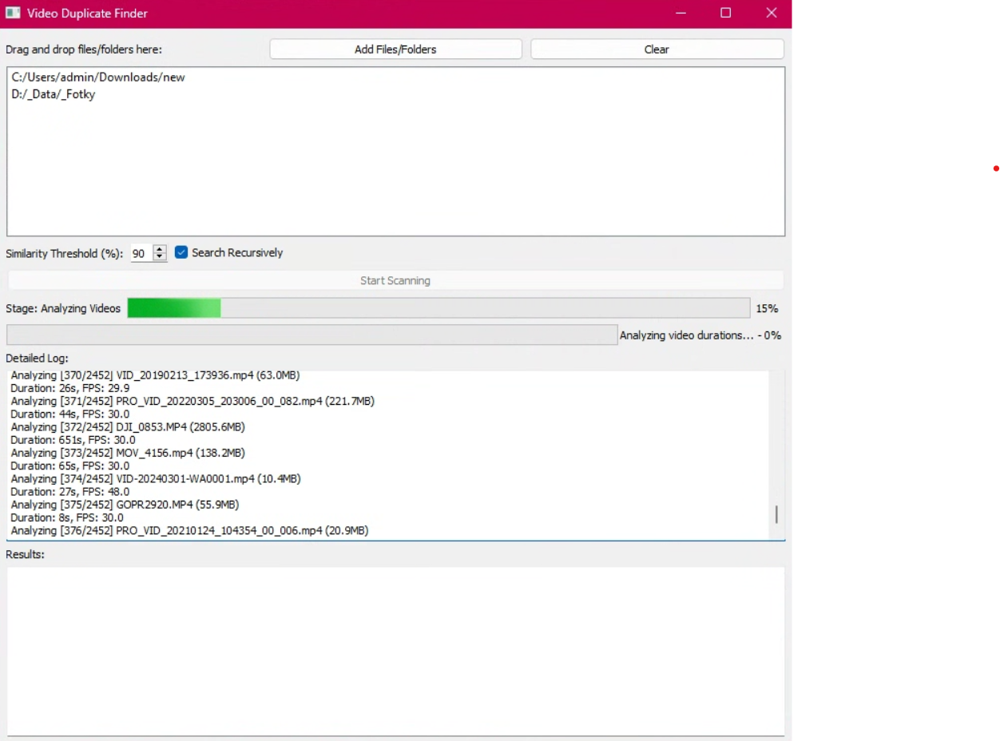

# Video Duplicate Finder



## Overview

Video Duplicate Finder is a powerful desktop application that helps you identify and manage duplicate video files across your computer. Using advanced video signature analysis, this tool can detect near-identical videos based on content similarity, resolution, and duration.

## Features

- 🔍 Advanced Video Comparison
  - Detect duplicate videos using frame-level signature comparison
  - Configurable similarity threshold (50-100%)
  - Support for multiple video formats (mp4, avi, mkv, mov, wmv, flv)

- 📂 Flexible Scanning
  - Drag and drop interface for adding files and folders
  - Recursive and non-recursive search options
  - Works with local file systems

- 🗑️ Smart Duplicate Management
  - Multiple strategies for handling duplicates:
    - Keep both files
    - Keep largest resolution video
    - Keep smallest file size
    - Keep newest file
    - Keep oldest file
    - Manual selection

- 🔒 Safe Deletion
  - Automatic backup of duplicate files
  - Detailed action logging
  - Preview and confirm actions before deletion

## Prerequisites

- Python 3.7+
- PyQt5
- OpenCV (cv2)
- NumPy

## Installation

1. Clone the repository:
   ```bash
   git clone https://github.com/yourusername/video-duplicate-finder.git
   cd video-duplicate-finder
   ```

2. Install required dependencies:
   ```bash
   pip install PyQt5 opencv-python numpy
   ```

## Usage

1. Run the application:
   ```bash
   python video_duplicate_finder.py
   ```

2. Add files or folders:
   - Click "Add Files/Folders" or drag and drop
   - Configure similarity threshold
   - Choose recursive/non-recursive search

3. Start scanning
   - Click "Start Scanning"
   - Review duplicate groups
   - Select which files to keep or delete

## Detailed Workflow

1. **Video Analysis**
   - Scans video files
   - Extracts frame signatures
   - Groups videos by duration

2. **Similarity Comparison**
   - Compares video signatures
   - Identifies potential duplicates
   - Provides similarity percentage

3. **Duplicate Management**
   - Preview duplicate groups
   - Choose keep/delete actions
   - Backup duplicates before deletion

## Screenshots

[You can add screenshots here showing the application interface]

## Limitations

- Performance depends on the number and size of video files
- Requires moderate system resources for large video collections
- Works best with videos of similar content and encoding

## Contributing

Contributions are welcome! Please:
- Fork the repository
- Create a feature branch
- Submit a pull request

## License

MIT License

Copyright (c) 2024 HCLivess

Permission is hereby granted, free of charge, to any person obtaining a copy
of this software and associated documentation files (the "Software"), to deal
in the Software without restriction, including without limitation the rights
to use, copy, modify, merge, publish, distribute, sublicense, and/or sell
copies of the Software, and to permit persons to whom the Software is
furnished to do so, subject to the following conditions:

The above copyright notice and this permission notice shall be included in all
copies or substantial portions of the Software.

THE SOFTWARE IS PROVIDED "AS IS", WITHOUT WARRANTY OF ANY KIND, EXPRESS OR
IMPLIED, INCLUDING BUT NOT LIMITED TO THE WARRANTIES OF MERCHANTABILITY,
FITNESS FOR A PARTICULAR PURPOSE AND NONINFRINGEMENT. IN NO EVENT SHALL THE
AUTHORS OR COPYRIGHT HOLDERS BE LIABLE FOR ANY CLAIM, DAMAGES OR OTHER
LIABILITY, WHETHER IN AN ACTION OF CONTRACT, TORT OR OTHERWISE, ARISING FROM,
OUT OF OR IN CONNECTION WITH THE SOFTWARE OR THE USE OR OTHER DEALINGS IN THE
SOFTWARE.

## Disclaimer

Always verify duplicates manually before deletion. The application provides recommendations, but final decisions are yours.
